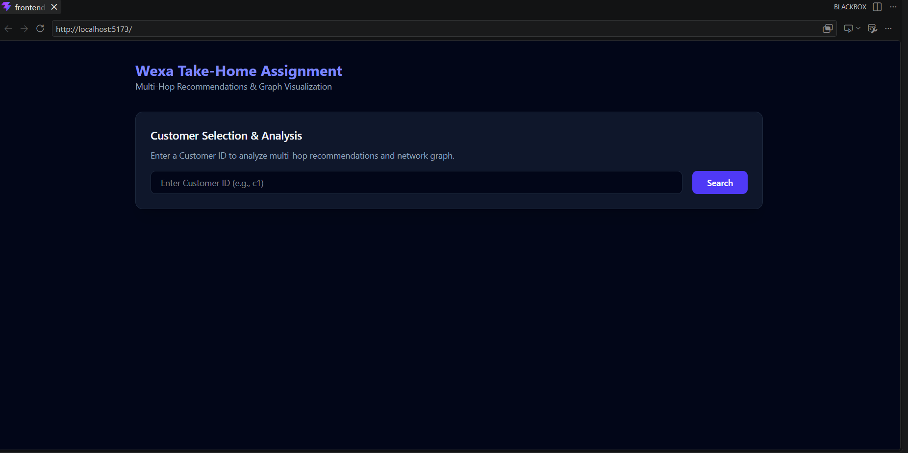
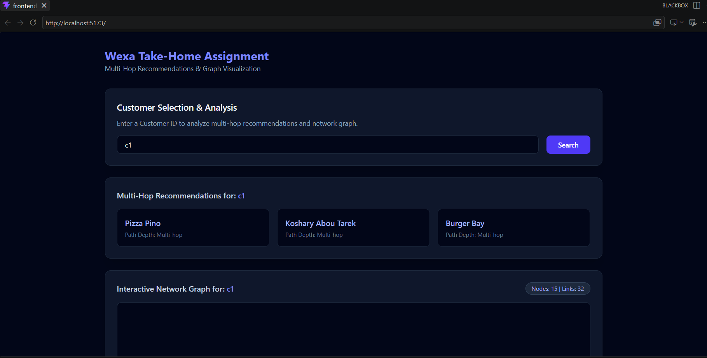
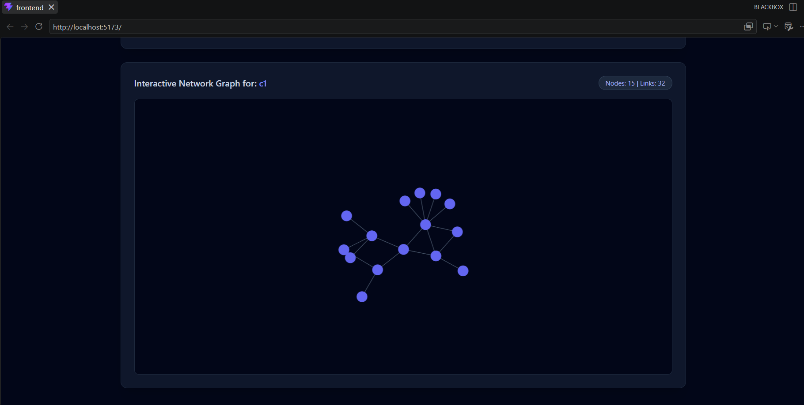

# GraphDB Application - Wexa AI Take-Home Assignment

A full-stack graph database application built with **CognoDB**, **Node.js**, **Express**, **React**, and the official **Neo4j JavaScript driver**.

---

## Live Demo

* **Hosted Application:** https://wexa-ai-take-home-assignmen-frontend.onrender.com
* **Screen Recording:** [Watch the application walkthrough on Loom](https://www.loom.com/share/ec40368f0a1f496a860ff82df08977fe)

---

## 1. Use Case

This application is a **Customer-Restaurant Recommendation & Trust Network**.

It models customers, friendships, restaurant preferences, ratings, and visits as a connected graph.

The application uses these relationships to:

* Recommend restaurants based on a customer's social network.
* Discover recommendations through friends and friends-of-friends up to **4 hops away**.
* Exclude restaurants the customer has already visited.
* Analyze trust-related graph patterns.
* Visualize the relevant graph connections.

---

## 2. Why a Graph Database?

The core of this application is the relationships between customers and restaurants.

A recommendation can require traversing multiple friendship relationships before reaching a restaurant:

```text
(Customer)
    │
    └── FRIEND ──> (Customer)
                       │
                       └── FRIEND ──> (Customer)
                                          │
                                          └── LIKES ──> (Restaurant)
```

In a relational database, this type of multi-hop traversal would require multiple joins or recursive queries, making the query more complex as the traversal depth increases.

With **CognoDB**, these relationships are directly represented in the graph and can be traversed naturally using Cypher.

This makes graph modeling a good fit for:

* Multi-hop recommendations.
* Social connections.
* Relationship-based filtering.
* Path existence and non-existence queries.

---

## 3. Data Model

```text
(Customer {id, name})
       │
       ├──[:FRIEND]──> (Customer)
       │
       ├──[:LIKES {rating, timestamp}]──> (Restaurant)
       │
       └──[:VISITED {date}]──> (Restaurant)

(Restaurant {id, name, cuisine})
```

### Nodes

**Customer**

```text
Customer {
  id,
  name
}
```

**Restaurant**

```text
Restaurant {
  id,
  name,
  cuisine
}
```

### Relationships

**FRIEND**

```text
(Customer)-[:FRIEND]->(Customer)
```

**LIKES**

```text
(Customer)-[:LIKES {
  rating,
  timestamp
}]->(Restaurant)
```

**VISITED**

```text
(Customer)-[:VISITED {
  date
}]->(Restaurant)
```

---

## 4. Setup & Run

### Prerequisites

* Node.js 18+
* npm
* A CognoDB Cloud account

### 1. Create a CognoDB Instance

1. Create an account at https://console.cognodb.com/signup.
2. Create a free **c0 instance**.
3. Select a region.
4. Save the generated password for the `cognodb` user.
5. Copy the connection URI:

```text
bolt+s://<instance-id>.databases.cognodb.cloud
```

### 2. Clone the Repository

```bash
git clone https://github.com/yehia0/Wexa-AI-Take-Home-Assignmen.git
cd Wexa-AI-Take-Home-Assignmen
```

### 3. Configure Environment Variables

Create `backend/.env` based on `backend/.env.example`:

```env
COGNODB_URI=bolt+s://<your-instance-id>.databases.cognodb.cloud
COGNODB_USER=cognodb
COGNODB_PASSWORD=your_generated_password
PORT=3000
```

> **Important:** Never commit `backend/.env` or database credentials to the repository.

### 4. Install Dependencies

Backend:

```bash
cd backend
npm install
```

Frontend:

```bash
cd ../frontend
npm install
```

### 5. Seed the Database

From the `backend` directory:

```bash
npm run seed
```

The seed script loads realistic customers, restaurants, friendships, ratings, visits, and overlapping relationships.

### 6. Run the Application

Start the backend:

```bash
cd backend
npm run start
```

In a separate terminal, start the frontend:

```bash
cd frontend
npm run dev
```

Open the URL provided by Vite.

---

## 5. Main Cypher Queries

### Multi-Hop Recommendation

The main recommendation query traverses the customer's social network up to **4 hops** to find restaurants liked by connected customers.

It also:

* Excludes restaurants already visited by the customer.
* Uses restaurant ratings.
* Removes duplicate recommendations.
* Uses parameterized Cypher through the official Neo4j JavaScript driver.

This is a graph traversal that would be awkward to implement with a fixed number of relational joins, especially as the traversal depth changes.

### Trust-Flags Query

The application uses a **path non-existence** query to identify trust-related conditions in the graph.

This query checks graph connectivity patterns rather than simply looking for individual rows, demonstrating a type of relationship-based query that is naturally expressed with Cypher.

### Graph Query

A separate Cypher query retrieves the relevant customer/restaurant subgraph used by the frontend to visualize the network.

---

## 6. Screenshots

### Main Application



### Recommendations



### Graph Visualization



---

## 7. Project Structure

```text
.
├── frontend/
│   ├── public/
│   │   └── icons.svg
│   ├── src/
│   │   ├── assets/
│   │   │   └── vite.svg
│   │   ├── components/
│   │   │   ├── CustomerSelector.jsx
│   │   │   ├── RecommendationsList.jsx
│   │   │   └── GraphVisualizer.jsx
│   │   ├── services/
│   │   │   └── api.js
│   │   ├── App.css
│   │   ├── App.jsx
│   │   ├── index.css
│   │   └── main.jsx
│   ├── index.html
│   ├── package.json
│   ├── postcss.config.js
│   ├── tailwind.config.js
│   └── vite.config.js
│
├── backend/
│   ├── src/
│   │   ├── db/
│   │   │   └── driver.js
│   │   ├── middleware/
│   │   │   └── errorHandler.js
│   │   ├── routes/
│   │   │   ├── customers.js
│   │   │   ├── restaurants.js
│   │   │   └── graph.js
│   │   ├── scripts/
│   │   │   └── seed.js
│   │   └── server.js
│   ├── .env.example
│   └── package.json
│
├── screenshots/
│   ├── 1.png
│   ├── 2.png
│   └── 3.png
│
└── README.md
```

---

## 8. Deployment

* **Frontend:** Render
* **Database:** CognoDB Cloud

The CognoDB instance will remain active while the submission is under review.
